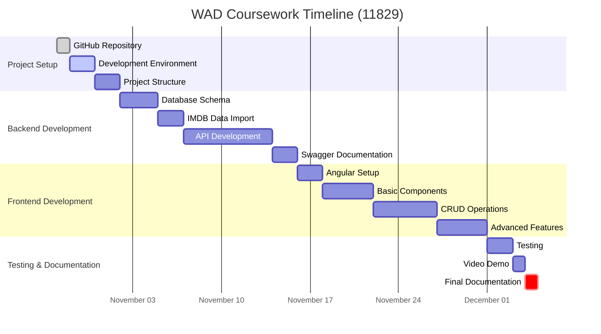

## Development Plan For the Coursework

### What I plan to build for the coursework

My aim in this coursework is to create a movies app based on the [IMDB Movies Dataset](https://www.kaggle.com/datasets/harshitshankhdhar/imdb-dataset-of-top-1000-movies-and-tv-shows) available on Kaggle. The general idea is to have an application that allows users to filter the movies and TV shows based on year, title, genre or rating as well as the ability to add or remove movies as new movies are released and user discovers old movies they want to add to the database. Based on this general aim, I am considering the following MoSCoW prioritization list.

### MoSCoW Prioritization
Below is a list of action items categorizez based on their priority according to the MoSCoW framework. The format is LIST ITEM: JUSTIFICATION.

#### Must haves
1. Database with movies imported from IMDB dataset (title, year, genre, rating): since this entire app is based on this dataset, it makes sense that the first step is creating a database populated with IMDB data that will be suitable to my C# ASP.NET Core application.
2. API endpoints for CRUD operations: this will be the backend that powers the application. It will be critical for making the app interactive (like adding or removing movies or tv shows) instead of having an app that just lists the movies and tv shows.
3. SPA interface to display list of movies: SPA interfaces are simpler and thus faster to build. Besides, a multi-page application doesn't make sense for a movies app with a few simple controls like searching and filtering.
4. Basic search functionality: Since the database includes about 1000 movies and TV shows, creating a basic title-based search is a strict requirement
5. Ability to add movies: New movies with high ratings are released roughly every month, so "Add" functionality must be there to keep the database up-to-date. Reloading the database source isn't practical because the source page mentions that the data is updated quarterly.
6. Ability to delete movies: Users must be able to delete movies based on their preferences and/or context requirements. For example, they may remove all R-rated movies as they don't fit the Uzbek culture and values.
7. Responsive design for SPA: responsive web design is a modern web dev requirement because it allows the app to be nicely presented in devices of varying screen ratios.

#### Should haves
1. Advanced filtering (by genre, rating, and year): improve user experience and increase the usability of the app
2. Sorting functionality (by rating, year, title): after user filters based on a criteria, they should be able to sort the results based on another criteria.
3. Pagination for movie list: it is necessary as there are about 1000 items in the database
4. User ratings for movies: this feature adds another layer of interactivity to the app and demonstrates update operation in CRUD.
5. API documentation with Swagger: The app isn't just about a user-friendly UI. It should have a friendly API and good documentation because it benefits developers

#### Could haves
1. User authentification and personalized watchlists: Adds personalization and further increases usability but requires significant additional development.
2. Movie details page with extended information from Wikipedia: enhances user experience by giving something to click on when they hover over movies but not essential for core functionality.
3. Integration with external APIs: there are probably more comprehensive APIs providing more detailed info on the movies in the IMDB dataset but increases app complexity.
4. Data visualization (for ex. charts of top-rated movies): Showcases data presentation skills but not critical for core features.

#### Won't haves
1. User reviews: beyond scope, requires complex moderation and storage considerations.
2. Recommendation system: this could be great feature to have but requires advanced ML algorithms.
3. Trailer playback functionality: Involves complex media handling with possible licensing issues.

### Displaying a Gantt chart

This section is for the project Gantt chart. I will be updating its status as I make progress on each of the tasks listed. 

